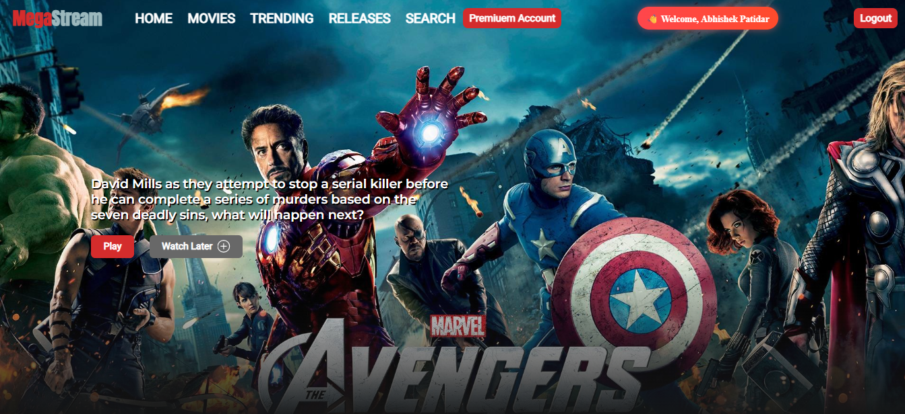
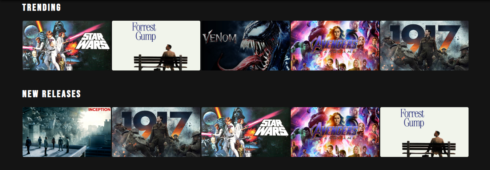
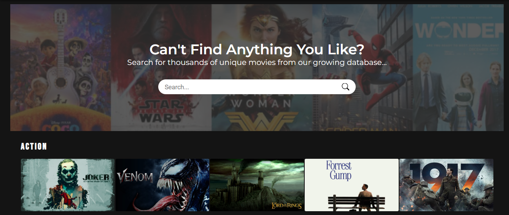
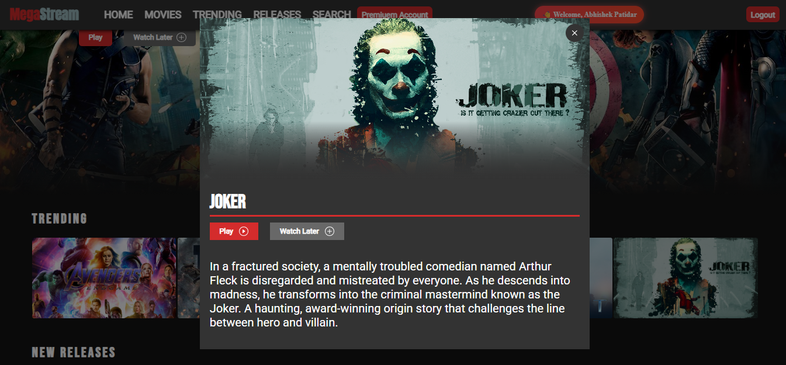
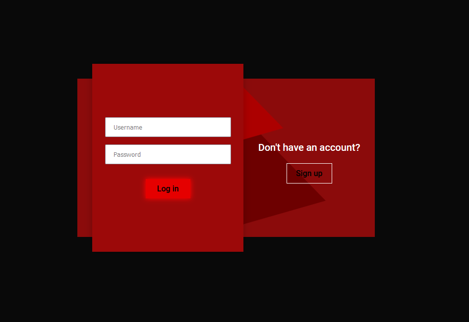
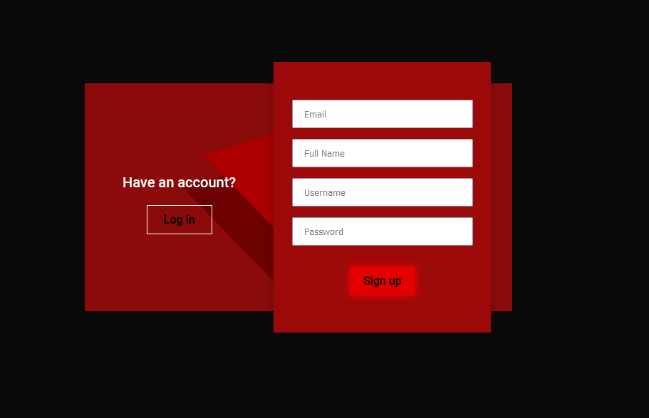
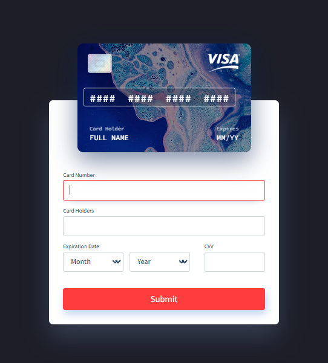

# 🎬 MegaStream – Movie Streaming Website

**MegaStream** is a modern and dynamic movie streaming website inspired by platforms like Netflix. Built using HTML, CSS, JavaScript for the frontend and Node.js, Express, and MongoDB for the backend, this full-stack project provides user authentication, dynamic movie sections, playlist management, and a premium account UI.

> 📌 **This project is developed as a part of my SIP – Summer Internship Project for MCA.**

---

## 🔥 Core Features

- ✅ **User Registration & Login (JWT-based)**
- ✅ **MongoDB Integration via Mongoose**
- ✅ **Responsive UI with Dynamic Content**
- ✅ **Watch Later / Playlist Support**
- ✅ **Logout, Auth Handling & Protected Routes**
- ✅ **Search Functionality (Client Side)**
- ✅ **Premium Page Setup**
- ✅ **Admin-Ready File Structure**
- ✅ **Interactive UI with Animations & Sliders**

---

## 🧩 Folder Structure

```
MegaStream/
│
├── backend/                  # Node.js backend API
│   ├── routes/               # Authentication and Watchlist APIs
│   ├── controllers/          # Logic for login, signup, and playlist
│   ├── models/               # Mongoose models for User and Watchlist
│   ├── middleware/           # JWT verification
│   ├── config/               # DB configuration
│   └── server.js             # Server entry point
│
├── auth/                     # Signup/Login UI
├── premium/                  # Premium features/cart page
├── assets/                   # All image thumbnails and logos
├── index.html                # Landing page (after login)
├── dashboard.html            # Default homepage (before login)
├── script.js                 # Main JS for frontend
├── style.css                 # Main stylesheet
└── README.md                 # Project info
```


---

## 🧠 Tech Stack

| Frontend | Backend | Database |
|----------|---------|----------|
| HTML5, CSS3, JavaScript | Node.js, Express.js | MongoDB Atlas |

---

## ⚙️ How to Run the Project

### 1️⃣ Clone the Repository
```bash
git clone https://github.com/yourusername/MegaStream.git
cd MegaStream
```

### 2️⃣ Backend Setup
```bash
cd backend
npm install
```

Create a `.env` file in `/backend` with the following:
```env
MONGO_URI=your_mongodb_uri
JWT_SECRET=your_jwt_secret
```

Then start the backend:
```bash
node server.js
```

### 3️⃣ Open the Frontend
Open `index.html` in your browser.

---

## 🌐 Live Demo (Optional)
> If hosted:
https://your-deployed-link.com/

---

## 📸 Preview










---

## 👨‍💻 Author

**Abhishek Patidar**  
MCA Student | Sage University  | Sunstone

🔗 [GitHub](https://github.com/abhishekpatidar)  
🔗 [LinkedIn](https://linkedin.com/in/abhishekpatidar997)

---

## 📌 Notes

- This project is for educational and Summer Internship Project (SIP) purposes.
- Payment and premium features are UI only (not connected to real gateways).
- Feel free to extend it with full backend integration, payments, and more.

---

